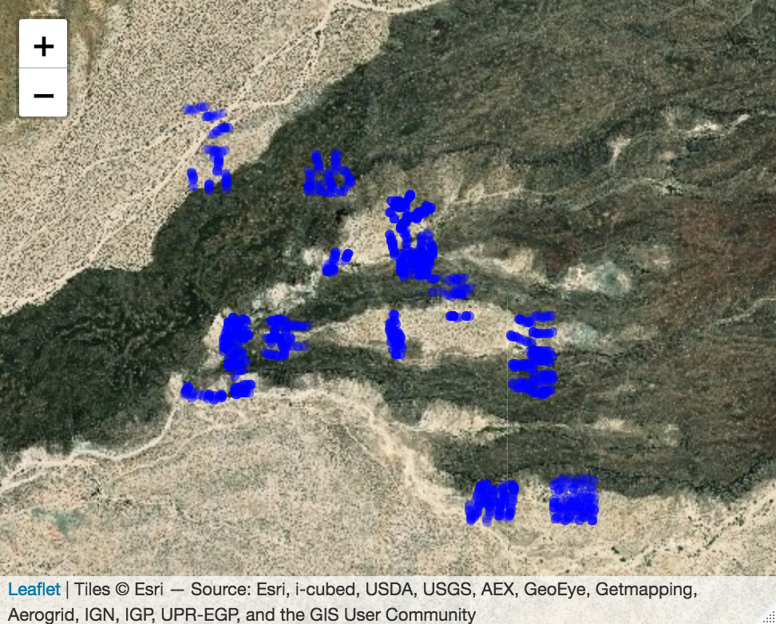
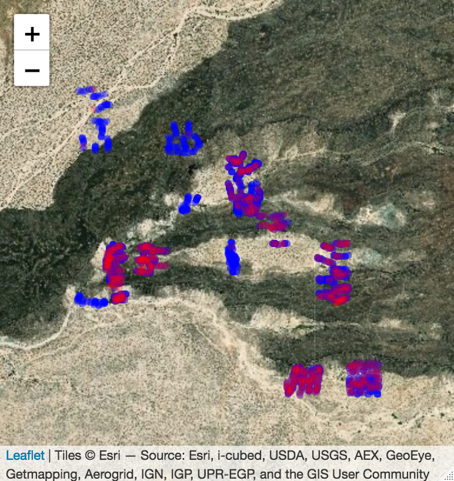
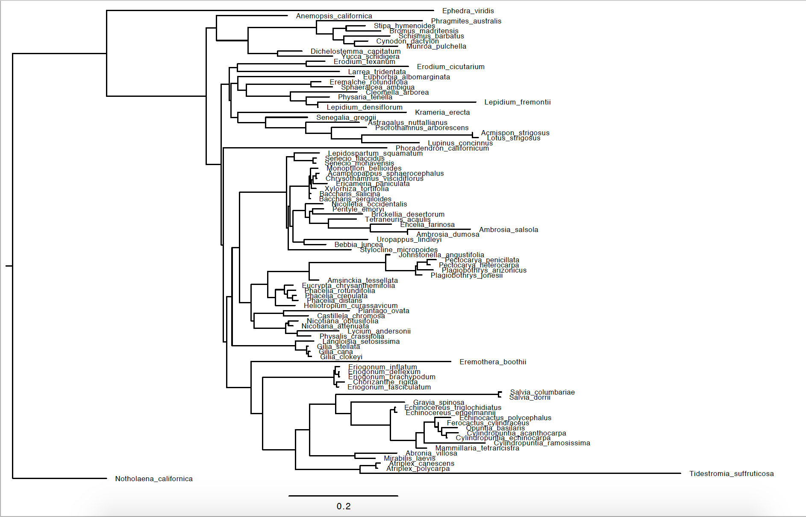
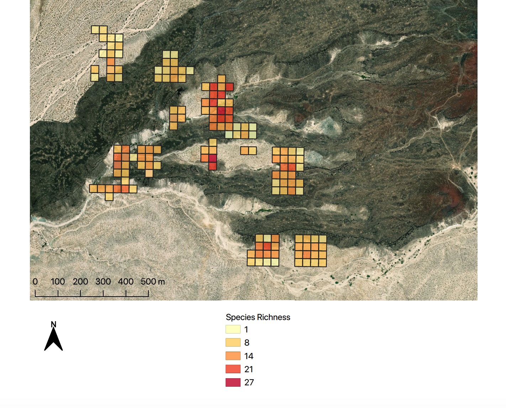
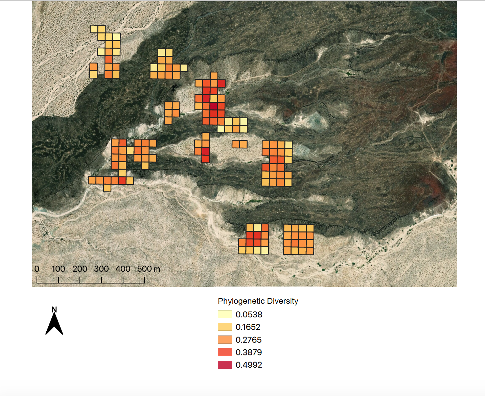
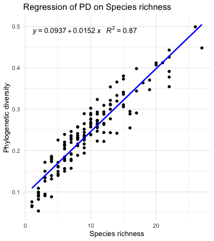
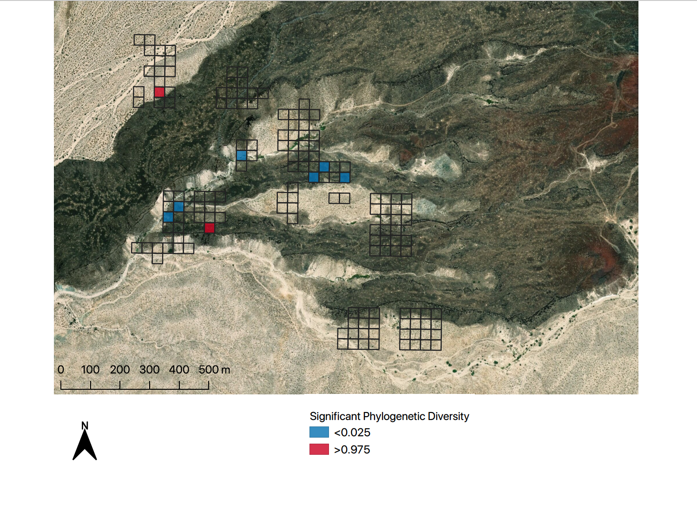
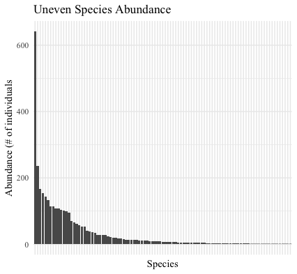
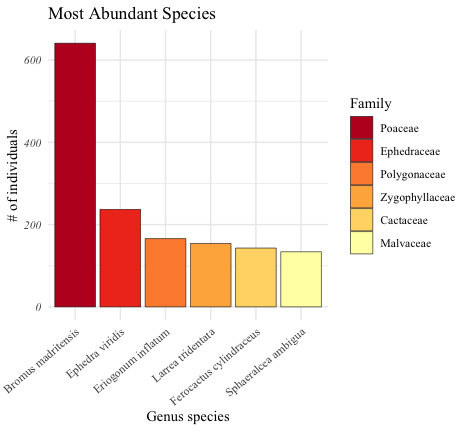
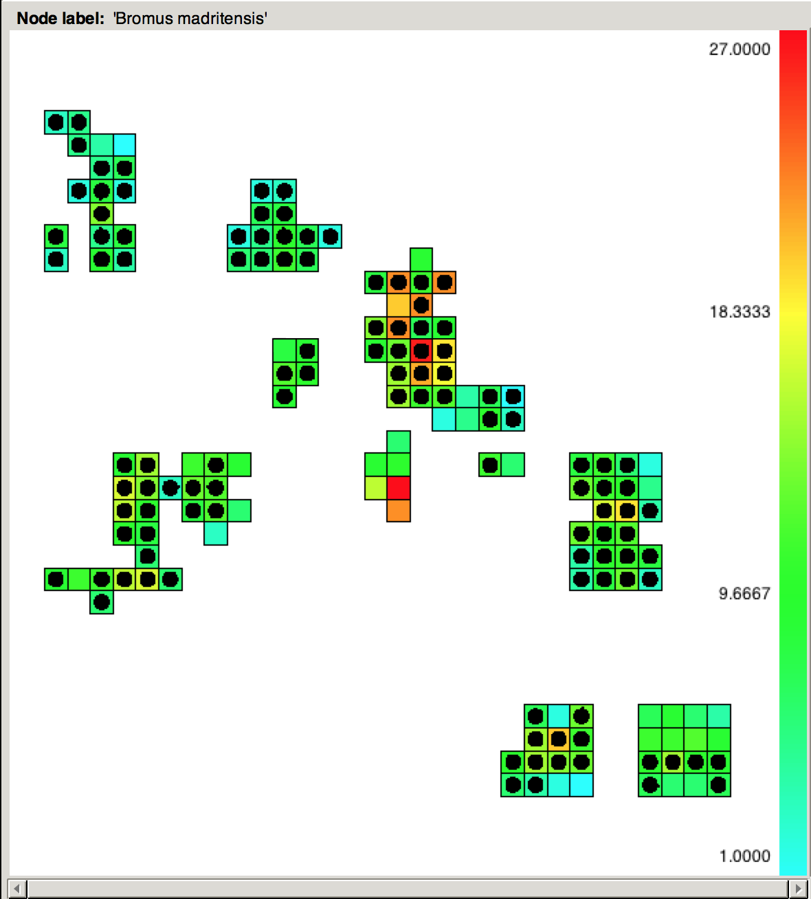

#### mnp_spatial_phylo
Repository containing the work done for my undergraduate honors thesis on the spatial phylogenetics of vascular plants in the Mojave National Preserve. 

## INTRODUCTION
Biodiversity is essential for providing ecosystem services to humans and is important to conserve in the face of habitat loss and climate change. While major efforts have prioritized protecting biodiversity hotspots in recent years, desert biomes remain undervalued. Biodiversity is often quantified through analyzing a region's species richness, species evenness, and species turnover. However, these standard metrics fail to take into account the evolutionary history of the organisms in an area. Spatial phylogenetics is a recently developed approach that evaluates several phylogenetic metrics including phylogenetic diversity (PD) to evaluate topics such as spatial ecology, community phylogenetics, and conservation prioritization. 

While these techniques are often applied at broader geographic scales to elucidate historical and evolutionary processes, I applied them at a very fine scale in a densely sampled region to explore ecological processes shaping community assemblage. In my research, I analyzed the spatial diversity patterns of vascular plants in the Mojave National Preserve in southern California. The field site is a 1km^2 plot in the Cane Spring region where Quaternary period basalt flows and perennial surface water availability characterize a hydrogeologically complex region. I tested the following hypotheses: 

*1. Can spatial phylogenetics explain diversity patterns at a small scale?*

*2. Do species richness and phylogenetic diversity strongly correlate at this site?*

*3. Are spatial diversity patterns related to geographic heterogeneity?* 

To answer these questions, I developed a pipeline in R to clean and analyze species occurrence data constructed by the citizen-science nonprofit Blueprint Earth. From plant spatial data, I constructed a maximum likelihood community phylogeny using nine nuclear and plastid loci (ITS, atpb, trnK, trnL, matK, matR ndhF, rbcl) for the site's 99 identified vascular plant species. Genetic data was sourced from NCBI’s GenBank. I then used the software BIODIVERSE to generate a biodiversity heatmaps for the study region. The results of this study illuminate how environmental abiotic factors likely predict the diversity patterns of vascular plants in this region of the Mojave Desert. The results may be valuable to land managers and policy makers seeking to conserve dryland plant biodiversity. Furthermore, these findings contribute to a deeper understanding of the evolutionary relationships of Mojave vascular plants.

## CONTENTS
This document details the functioning of the scripts constituting the data analysis pipeline I built. It also presents the results of the study, interpretations, and a discussion of further potential avenues for scientific exploration. 

The order the scripts should be run is as follows:

**1.	aggregate_spatial_data.R**

**2.	clean_species_names.R**

**3.	clean_spatial_data.R**

**4.	get_fasta_files.R**

**5.	align_sequences.R**

Notes documenting each script are below.

### Wrangle data (**aggregate_spatial_data.R**)
This script wrangles any number of CSVs containing biological spatial data into a master dataframe that is subsetted for columns of interest and saved as a CSV for further analyses. Parameters can be changed indicating which columns are to be selected.

### Clean taxonomy (**clean_species_names.R**)
In writing this script I chose to prioritize automation; therefore, I inevitably sacrificed accuracy. I have found that for the most accurate results possible it is best to use a combined automated-manual approach to cleaning taxa names, using the packages ‘taxize’ and ‘magrittr’. While using the functions to submit taxa names to the Global Names Resolver (GNR) catches most of the spelling issues, there are some outstanding errors in the databases that taxa names are compared to, which remain in the final data product.

For example, there were two variations of the spelling of the taxa name _Cylindropuntia ramosissima_ in my spatial data. Those being 
1. the correct spelling 
2. _Cylindropuntia ramossissima_, misspelled with an additional s. The “The International Plant Names Index” (IPNI) database lists the misspelling as a valid entry, and so it remains in the final column containing ‘correct’ taxa names. 

Another error encountered is the inclusion of similarly spelled taxa names which could conceivably be misspellings but are simply incorrect. For example, the species _Cryptantha angustifolia_ occurs in the study area. However, the GNR process perceives the genus as a misspelling of _Cryptandra_, for which there is a species _Cryptandra angustifolia_ whose native range is limited to Australia. Therefore, _Cryptandra angustifolia_ is included in the final data product, which is an issue that I have no automated solution to. 

Erroneous correction on the basis of using the fewest character changes possible
In the case of moss included in the spatial data as “Bryophytes”, while this should be corrected to “Bryophyta”, the scientific group for moss, the algorithm instead corrects this to “Dryophytes”, the scientific group name for the genus of Ameroasian treefrogs in the family Hylidae, on the basis of “Dryophytes” being one character off from “Bryophytes”, whereas “Bryophyta” is two characters off. 

Similar issues emerged when I attempted to query the Integrated Taxonomic Information System (ITIS) database for Family names, however these were mainly due to synonym discrepancies between taxa that had sequences on GenBank listed under an outdated synonym which is no longer the official synonym listed by ITIS. In order to work around this problem, I again used a mixed-automated manual solution. I ran a function to pull family level information from ITIS for a given list of species and store it in a dataframe. Every time this function failed, I made a note of which species name wasn’t listed on ITIS and then manually created a vector of family names for these species, which I merged with the dataframe that had family level information for all the taxa in the study area.

### Clean spatial data (**clean_spatial_data.R**)
All spatial data collected by Blueprint Earth were in Lat/Long, while some were also collected in Easting/Northing. Due to uncertainty about the origins of these UTM coordinates, only data in Latitude/Longitude format were used for the spatial cleaning. At the end, I used the ‘sf’ package to create a spatial points data frame, projecting the coordinates all at once into UTM Zone 11N. 

As a result of inconsistencies in data collection methods used by Blueprint Earth across different field seasons, some data were collected in degree, minute, second format (DMS) while some data were collected in decimal degrees (DD). In order to rectify this, I split the data into two dataframes, one with DD data and one with DMS data, cleaned each for errors, converted the DMS to DD, and then merged the dataframes back together. (3,964 points) Lastly, I filtered the final dataframe to remove points whose Genus_species were unknown, in order to prepare for phylogenetic and diversity analyses. This left me with with 3,382 clean data points, more than double that of what I had available for my poster at Botany 2019 (1,455 clean data points).The clean spatial data frame was used to create a final list of 99 species to be queried for genetic data on NCBI’s GenBank. 

  

  

### Aggregate genetic data (**get_fasta_files.R**)
I wrote a script, get_fasta_files.R,  that takes a list of taxa, a character vector of target genes, and queries GenBank to download FASTA files with available genetic sequences for the desired taxa. This aggregation of genetic data is the first step before aligning the individual genes and then building a ‘supermatrix’ for use in RAxML to ultimately build a community phylogeny. 

**get_fasta_files.R** has a series of steps in order to go from taxa to fasta. First, a CSV of taxa are loaded in, along with a character vector of target genes. Next, a dataframe of GenBank query terms is assembled from the taxa and genes. I wrote a function to pull available genetic sequences from GenBank that are less than 10,000 base pairs long as I am constrained by computing power and the alignment tool. This step bypasses available genetic data that could be used. For example, for genes such as rbcL that are in the chloroplast, some species only had one available source of rbcL sequences, that being the entire Chloroplast genome itself. In this scenario, my script essentially acts as though there are no rbcL sequences available. These limitations and assumptions are detailed in the code itself so that the function can be customized based on the user’s needs and abilities.

Once this function runs (~ 20 minutes for me on the basis of 8 genes x 99 species = 792 query terms), the dataframe of GenBank IDs is saved to a CSV. The ID dataframe is then used to determine which species lack data on GenBank. For these species, I cross-checked CalFlora to note their range within the state and verify if it overlaps in the study area. I then checked GenBank for synonyms listed on CalFlora. I chose to remove species listed in the spatial data that were not expected in the study area based on CalFlora’s map of species occurrences within the state of California. I also removed species that only had a few occurrences in my spatial data, chalking these up to identification errors in the field.

Examples of species that were removed:

_Dalea greggii_ - only one occurrence listed on CalFlora, outside of the study area. Only one point in the spatial data.

_Hieracium nudicaule_ - CalFlora indicates only a Northern California distribution. Only 3 points in spatial data.

_Solidago juliae_ - Not native to California, not present on CalFlora. Very likely a mis-ID for _Ericameria paniculata_.

### Align genetic data (**align_sequences.R**)
This script takes in a directory containing individual FASTA files for each gene of interest. It iterates through the files in the directory, aligning each of them and saving the outputs to a new directory titled ‘alignments’.

## RESULTS
Summary statistics:
149 grid cells (35m x 35m) -> 36.6% of study area sampled.
3,382 points for 99 species across 28 botanical families.

### Community phylogeny
A maximum likelihood community phylogeny was constructed through RAxML accessed through the UC San Diego supercomputer server CIPRES. Branch lengths indicate number of nucleotide substitutions, where longer branches are more genetically unique and shorter branches indicate species that are less genetically unique. The tree was rooted around Notholaena californica, a fern which represents the outgroup as the most distant relative from all of the other species, which are all angiosperms except for Ephedra viridis, which is a gymnosperm.

  

### Species Richness
The heatmap of species richness illustrates the greatest diversity of taxa in the center of the sampled area. Species richness cell values indicate the total number of species that occurs within that area. Further analyses must be conducted in order to understand why this is. Preliminary hypothesis is that transition zones between geologic types along slope gradients close to available surface water will host more diversity than other sites.

  

### Phylogenetic Diversity (PD)
The heatmap of PD indicates similar diversity patterns to that of species richness, with slight variation. The value of each grid cell represents the proportion of the sum total branch lengths of the phylogenetic tree that is represented by all species in that area.

  

### Significance tests
In order to test the null hypothesis (ie: determine the degree to which PD differs than expected based on species richness alone), I plotted a least squares linear regression of PD on Species richness. The R^2 correlation coefficient value of 0.87 indicates that this variation demonstrates nonrandom assemblage pattern of diversity in the study area.

  

A two-tailed spatial randomization test was conducted to determine the exact regions where PD is significantly lower or higher than expected based on species richness. This test randomly shuffles without replacement, over 1000 iterations, the list of species present in the study area into the grid cells while keeping the number of species per grid cell constant as well as the total range size (ie: number of grid cells for each species) constant. The significant PD heatmap indicates cooler regions of phylogenetic clustering (species are more closely related to one another than expected) and warmer regions of phylogenetic overdispersion (species are less closely related to one another than expected). 

  

PD clustering could be due to environmental selection for phenotypic traits that confer higher fitness, assuming these traits have phylogenetic signal. PD overdispersion could indicated regions with higher habitat heterogeneity and thus niche differentiation, or areas where interspecific competition has driven trait specialization. Further data (environmental data, genetic data for functional traits) is needed to understand these patterns.
Evenness

  

A bar plot of species abundances indicate skewed distribution of taxa across landscape, where the majority of species are relatively uncommon, while there are a few species which are very common. Each bar represents a single species, with 99 bars total. The top 10 most abundant species (~10% of the total species) represent over 56% of the plant occurrences. This skewed abundance distribution is a normal phenomenon in ecology, and expected in a desert ecosystem which is fairly sparsely vegetated (probably an adaptation to reduce fire under extremely hot and dry conditions). 

  

However, the fact that the most abundant species, Bromus madritensis, an invasive annual grass, occurs more than 3x as frequently as the second most abundant species, is problematic for several reasons. Firstly, it means that this species is outcompeting native annuals, evidence by how prolific it is. Secondly, this species’ success has significant downstream implications for the ecosystem as its density leads to higher frequency of fires. Under various climate change scenarios, the weather patterns will become more extreme, with hotter summers and wetter winters, leading to more intense fire events. Furthermore, this grass is one of the most common species to appear post-fire, so its presence induces a positive feedback loop with negative ramifications for the Mojave ecosystem.

  

Map illustrating distribution of Bromus madritensis across study area, where black dots indicate grid cells that this species occurs in. Bromus madritensis occurs in 80% of sampled area (119 of 149 grid cells). But interestingly, it doesn’t occur in the center, which has the highest diversity. 

## NEXT STEPS

Write guidelines for Blueprint Earth data collection methods.
Based on the analyses conducted thus far, it would be helpful to inform Blueprint Earth of ideal vegetation data collection methods moving forwards to ensure high quality data. Unfortunately, due to discrepancies in data collection methods across field seasons, as well as the degree of human error introduced in the analogue collection and digitization process, a large number of data points were ultimately thrown out in the data cleaning process. 

Guidelines:

**1. Collect all spatial data in Lat/Long format**

**2. Use Esri’s Collector app to streamline data collection process, removing the step of digitizing, which saves time and also reduces human error.**

**3. Store data in SQL relational database or another format that is not just a collection of CSVs**

**4. Perform functional ecological trait analysis.**

Identify certain genes that are associated with functional ecological traits (ex: Nitrogen fixing). Query GenBank for those genes and build a new phylogeny, illustrating derivation of these traits and grouping descendants accordingly. Perform spatial analysis to determine if there are any statistically significant patterns of clustering or dispersal along the landscape. Interpret patterns and develop hypotheses for why these are occurring.

**5. Perform phenological analysis.**
Determine spatial distribution patterns between and within annuals, perennials. In Mojave Desert, annuals are mostly active in the winter and spring and use the C3 photosynthetic pathway. Are there any variations in this pattern across the study site? Are most annuals C3, or are some C4? What are the factors impacting seasonal growth of annuals across the study site? How do these general patterns shift during super bloom events? What is the temporal relationship of ENSO cycles with superblooms? Are there patterns of certain plants that grow next to shrubs like Larrea tridentata? Or are there any species that stand out as nitrogen fixers / shade providers which are dominant / important in the ecosystem for other species that require shade?

*Phenological analysis would be conducted in conjunction with functional trait analysis.*

**6. Employ UAV-based remote sensing techniques to analyze environmental variables driving plant diversity patterns.**

Fly a drone over study site to collect high resolution RGB imagery, high resolution Digital Terrain Model (DTM). Build a hydrological model from DTM, create land cover data from RGB orthomosaic. Employ statistical spatial analysis to determine relationships between explanatory environmental variables and dependent diversity patterns.

**7. Conduct more vascular plant surveys to fill in gaps in genetic data for species.**
Many species in the study area do not have genetic data available on GenBank. In order to incorporate these taxa into the phylogenetic analyses, specimens need to be identified and collected, both for DNA extraction as well as plant press specimens to be deposited at the UC Jepson Herbarium. 

**8. Automate all analyses.**
Write more scripts to conduct all analyses in an automated, reproducible fashion. Use BIODIVERSE R pipeline instead of graphical user interface (GUI). Find R package for creating supermatrix instead of using Sequence Matrix. Use command line RAxML for constructing maximum likelihood phylogeny as opposed to CIPRES server.
